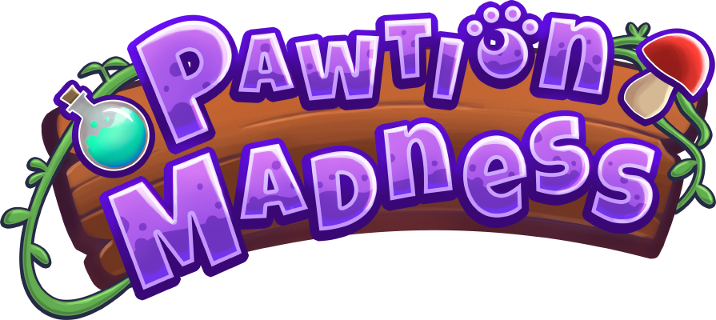

# Poner nombre del juego acá

Tower defense and cooking games mix in this frenetic experience. Brew magical potions to summon cute creatures and defend your house from the looming threat of the fairy empire!

This is a game being developed by students from <a href="https://www.imagecampus.edu.ar/">Image Campus</a>

   

## Credits

- **Nombre Apellido (ORDENAR IGUAL QUE CREDITOS EN JUEGO)** - *Programming*
- **Ignacio Arrastua** - *Programming*
- **Enzo Coletta** - *Programming*
- **Zoe Cazas Telias** - *Art*
- **Lara Menendez** - *Art*
- **Nicolas Lannert** - *Audio*
- **Felipe Molina** - *Audio*
- **Juan Sebastian Rey** - *Audio*
- **Leonardo Martin Nucaro** - *Testing*
- **Jesus Parra** - *Testing*
- **Agustin Pratto** - *Testing*

This game was also possible thanks to the support of these professors:

- **Sergio Baretto**
- **Juan Pablo Varela Aloisio**
- **Ramiro Cabrera**
- **Eugenio Taboada**
- **Nazareno Rivero**
- **Lucía Inés Patetta**

## Acknowledgements

- **Federico Barra**
- **Franco Guerra**
- **Silvina Lemos Hoffmann**
- **Lautaro Maciel**

## Links

Download it from itch.io: https://michibrujas.itch.io/pawtion-madness
